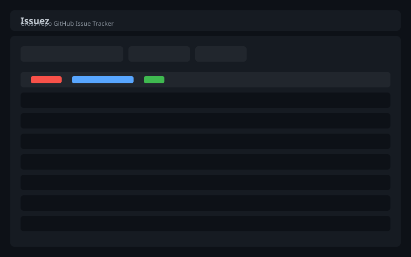
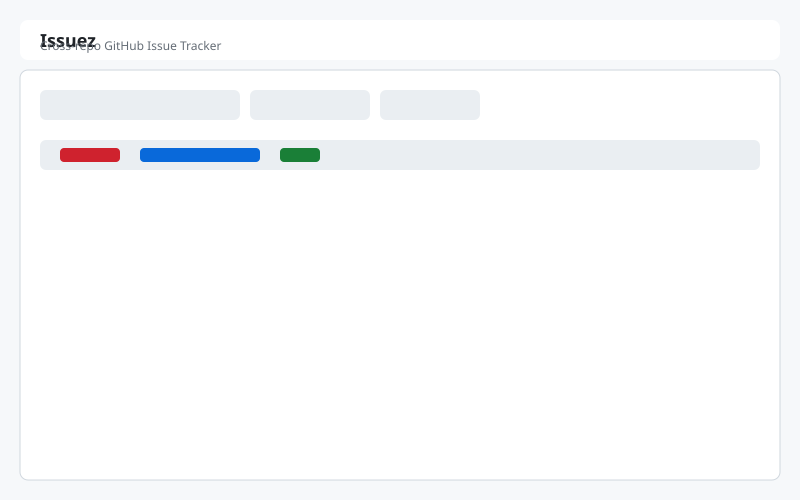
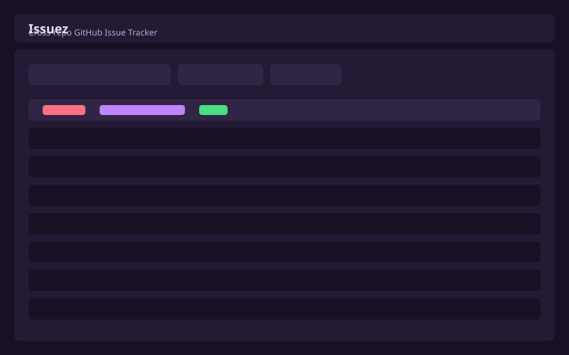
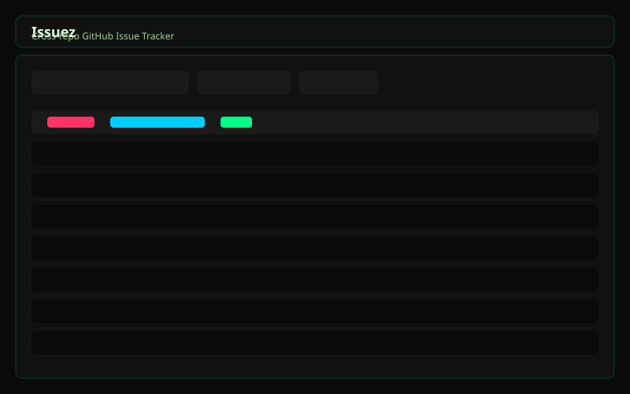
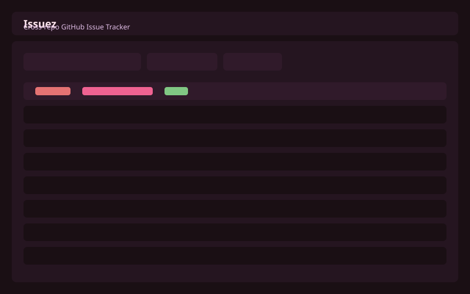

# Issuez — Cross-Repo GitHub Issue Tracker


**Issuez** aggregates every issue assigned to you across all your GitHub repositories and organizations into a single, modern dashboard — no organization setup required.



## Features

- **Cross-repo aggregation** — See all issues assigned to you across every repo and org in one table
- **Priority ranking** — Issues are ranked by severity derived from labels (`priority: critical`, `high`, `medium`, `low`)
- **Status simulation** — Simulate workflow with `status: todo`, `in-progress`, `done` labels
- **Full-text search** — Search across issue titles and bodies in real time
- **Filter & sort** — Filter by repo, state, and label; sort by priority, date, repo, or comments
- **Inline management** — Close/reopen issues, add comments, and cycle status labels directly from the UI
- **5 themes** — Dark, Light, Colorful, Neon, and Pink
- **Layout export/import** — Download/upload your layout config as JSON to move between machines
- **Client-side only** — Runs entirely in the browser with no backend server


## Screenshots
<details>
  <summary>Click to expand</summary>

### Dark Theme


### Light Theme


### Colorful Theme


### Neon Theme


### Pink Theme

</details>

## Quick Start

1. Open the app in your browser (GitHub Pages or local)
2. Click **Use Personal Access Token** and paste your token
3. Browse, search, filter, and manage your issues

## Authentication

Issuez runs entirely client-side, so it uses a **Personal Access Token (PAT)** instead of OAuth. GitHub’s OAuth `access_token` endpoint blocks browser requests via CORS, so a backend would be required for OAuth.

1. Go to https://github.com/settings/tokens
2. Generate a new token (classic) with scopes:
   - `repo` (to read and write issues)
   - `read:org` (to list organization repositories)
3. Paste the token into the login field
4. Click **Connect**

**Security note:** Your token is held in browser memory only (`sessionStorage`). It is discarded when you close the tab or log out. It is never written to `localStorage`, cookies, or any persistent storage.

## Themes

Switch themes from the header dropdown. Available themes:

| Theme | Description |
|-------|-------------|
| **Dark** | Standard dark mode with GitHub-inspired colors |
| **Light** | Clean, bright theme for daytime use |
| **Colorful** | Vibrant purple accents on a deep background |
| **Neon** | High-contrast glowing highlights on pure black |
| **Pink** | Warm pink-dominant palette |

Theme selection persists across sessions via `localStorage`.

## Layout Export / Import

Since Issuez runs entirely client-side, your layout preferences are stored in `localStorage`. To move them between devices:

1. Open **Settings**
2. Click **Export Layout** — downloads `issuez-layout.json`
3. On another device, open **Settings** → **Import Layout** and select the file

## Forking & Custom Deployment

You can fork this repo, add your exported layout file, and deploy your own personalized version on GitHub Pages in minutes.

1. Fork the repository
2. (Optional) Add your `issuez-layout.json` to the root of the fork
3. Go to **Settings → Pages** in your fork
4. Set **Source** to `Deploy from a branch` and select `main` / `/root` (or `/dist` if using the single-file build)
5. Your personalized instance is live at `https://<your-username>.github.io/issuez/`

No backend, no server setup, no data storage — just your layout and themes applied instantly.

## Architecture

### Single-File Build

The production build bundles all CSS and JavaScript into a single `dist/index.html` file. This makes deployment to GitHub Pages trivial — just enable Pages and point it at the `dist` folder (or root if you copy `index.html` there).

### Development

```bash
npm install
npm run dev
```

Open http://localhost:3000 to see the app in development mode.

### Build

```bash
npm run build       # Standard Vite build (dist/ + assets/)
npm run build:single # Single-file HTML output (dist/index.html)
```

### API

The app uses the GitHub REST API v3:

| Endpoint | Purpose |
|----------|---------|
| `GET /user` | Current authenticated user |
| `GET /user/repos` | User's repositories |
| `GET /user/orgs` | User's organizations |
| `GET /orgs/{org}/repos` | Organization repositories |
| `GET /repos/{owner}/{repo}/issues` | Repository issues (PRs filtered out) |
| `GET /repos/{owner}/{repo}/issues/{number}/comments` | Issue comments |
| `POST /repos/{owner}/{repo}/issues/{number}/comments` | Post comment |
| `PATCH /repos/{owner}/{repo}/issues/{number}` | Update issue (state) |
| `POST /repos/{owner}/{repo}/issues/{number}/labels` | Add label |
| `DELETE /repos/{owner}/{repo}/issues/{number}/labels/{name}` | Remove label |

**Rate limits:** 5,000 requests/hour for authenticated requests. The app monitors `X-RateLimit-Remaining` and pauses requests when the limit is exhausted.

**Pagination:** The app follows `Link` headers to fetch all pages of results automatically.

## Security

- **No backend server** — The app runs entirely client-side in the browser
- **No persistent storage** — Your token is held in memory (`sessionStorage`) only and is discarded when you close the tab or log out
- **No cookies, no localStorage for tokens** — Only layout preferences and theme are stored locally
- **Direct GitHub API** — All requests go directly to GitHub; no proxy or intermediary
- **Revocable access** — You can revoke your PAT at any time from GitHub Settings → Applications

## Roadmap

- [ ] GraphQL support for faster cross-repo queries
- [ ] Saved filters and views
- [ ] Issue assignment and unassignment
- [ ] Batch operations (close multiple, add labels)
- [ ] Keyboard shortcuts
- [ ] Desktop notifications for new assigned issues
- [ ] PWA support for offline access

## Contributing

Pull requests are welcome. Please preserve the existing architecture and match the code style.

## License

MIT
